# Knowledge Hub Desktop 详细开发方案

版本：V1.1  
日期：2026-05-03  
目标读者：产品经理、项目经理、开发经理、架构 Agent、前端 Agent、后端 Agent、桌面端 Agent、测试 Agent、文档 Agent

---

## 0. 一句话目标

Knowledge Hub Desktop 是一个完整桌面客户端应用，用于把用户多台设备上的本地文件、SMB 挂载目录、同步目录、各类 Agent 产出和候选 memory 统一归集到一个受控、可加密、可审计、可同步的个人 AI 知识中枢。

其他 Agent 不直接读取知识库、向量库、文件库或 memory 数据库。所有 Agent 只能通过 Knowledge Hub 的 MCP / REST 接口请求 context pack，并提交 artifact 与 candidate memory。

---

## 1. 产品边界

### 1.1 必须做

- 提供完整桌面客户端，不要求用户手动打开网页后台。
- 支持单机模式和多设备模式。
- 支持迷你主机作为中心节点。
- 支持其他电脑注册为客户端节点。
- 支持本地目录、SMB 挂载目录、网盘同步目录的文件监听和扫描。
- 支持 Agent 输出目录监听。
- 支持 memory-export.json 标准导入。
- 支持 MCP Server 和 REST API。
- 支持 context.request，即根据任务返回相关知识、memory、模板、规则、SOP、风险提示和引用来源。
- 支持候选 memory 审核后入库。
- 支持敏感数据加密传输和加密存储。
- 支持设备注册、设备撤销、设备心跳、离线缓存、恢复补传。
- 支持 Dashboard、数据源管理、设备管理、Agent 管理、Knowledge 管理、Memory 管理、Artifact 管理、Review Queue、设置。

### 1.2 第一版不做

- 不直接对接 Google Drive、WPS 云、小米云官方 API。
- 不做多人企业级 RBAC。
- 不做自动故障转移。
- 不做本地大模型推理。
- 不做复杂知识图谱。
- 不做自动修改用户原始文件。
- 不允许 Agent 绕过 Hub 直接访问底层数据库。

### 1.3 可后置增强

- OCR。
- 知识图谱。
- 自动中心节点迁移。
- 云账号登录。
- 团队协作。
- 端到端字段级加密。
- Agent 行为审计评分。
- 图像、视频、音频理解。

---

## 2. 核心原则

1. 客户端是用户唯一入口。Hub Service 是后台服务，对用户尽量透明。
2. 中心节点是唯一权威源。客户端节点只缓存和上传。
3. Agent 不直接读知识库。Agent 只向 Hub 请求上下文。
4. Agent 不直接写长期 memory。Agent 只能提交 candidate memory。
5. 所有跨设备传输必须加密和签名。
6. 所有 sensitive content 入库必须加密。
7. 所有写入采用 append-only event log，避免多设备覆盖冲突。
8. 文件监听必须有定时扫描兜底，因为 SMB 和同步盘事件可能漏报。
9. Context Pack Builder 是核心业务模块，不是简单向量搜索。
10. Review Queue 是知识治理入口，避免 memory 污染。

---

## 3. 角色和节点

### 3.1 用户角色

- Owner：当前 workspace 的拥有者，拥有全部管理权限。
- Device Operator：设备本机使用者，通常也是 Owner。
- Agent：外部 AI Agent 调用方，包括 OpenClaw、HERMES、Codex、Gemini CLI。

第一版默认单用户 Owner，不做复杂用户体系。

### 3.2 设备角色

- Standalone Device：单机模式设备。
- Hub Device：中心节点设备，运行完整 Hub Service 和中心存储。
- Client Device：客户端节点，运行 Desktop Client、Local Collector、本地缓存。

### 3.3 Agent 角色

- Reader Agent：只请求 context，不提交 memory。
- Worker Agent：请求 context，并提交 artifact。
- Memory Candidate Agent：请求 context，提交 artifact 和 candidate memory。
- Admin Agent：未来可选，协助整理知识库，但第一版不开放直接写正式库。

---

## 4. 总体拓扑

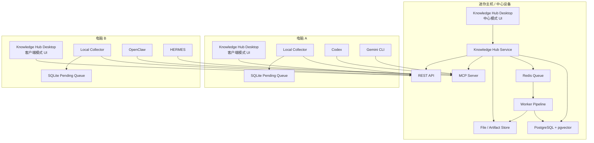

---

## 5. 进程拓扑

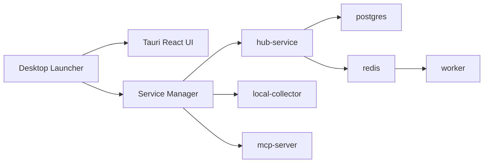

### 5.1 单机模式进程

- desktop-client
- hub-service，只绑定 127.0.0.1
- local-collector
- mcp-server，只绑定 127.0.0.1
- postgres 或 SQLite + pgvector 替代方案
- redis 可选，MVP 可用内置队列

### 5.2 多设备中心模式进程

- desktop-client
- hub-service，绑定局域网地址或 Tailscale 地址
- local-collector
- mcp-server
- postgres + pgvector
- redis
- worker
- file/artifact store

### 5.3 多设备客户端模式进程

- desktop-client
- local-collector
- SQLite pending queue
- optional local mcp proxy

---

## 6. 部署形态

### 6.1 开发环境

- Docker Compose 启动 hub-service、postgres、redis、worker、mcp-server。
- Tauri 客户端本地 dev server。
- Collector 本地 Python 进程。

### 6.2 产品环境

#### Windows 客户端安装包

- Knowledge Hub Desktop。
- Local Collector。
- Hub Service 可选组件。
- MCP Server 可选组件。
- 服务管理器。

#### 中心节点安装包

- Knowledge Hub Desktop 中心模式。
- Hub Service。
- PostgreSQL + pgvector。
- Redis。
- Worker。
- MCP Server。
- 本地数据目录初始化工具。

---

## 7. 首次启动流程

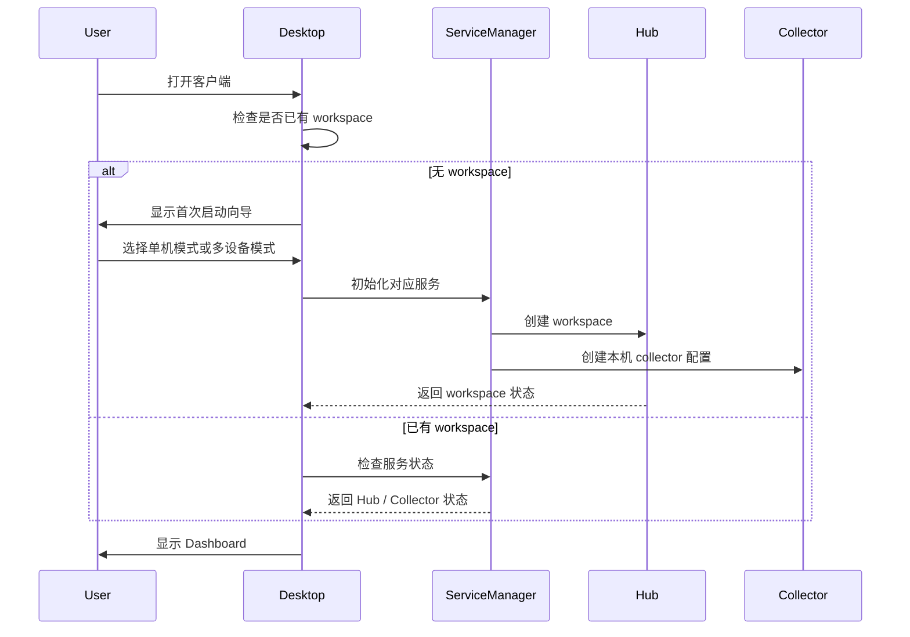

---

## 8. 单机模式详细流程

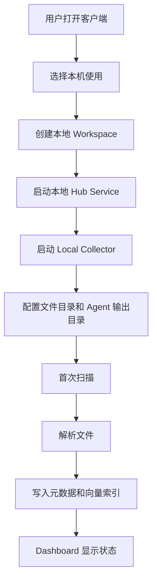

单机模式安全要求：

- Hub Service 默认只监听 127.0.0.1。
- MCP Server 默认只监听 127.0.0.1。
- 不生成远程邀请码。
- 不接受外部设备注册。
- 本机 Agent 调用不需要设备注册，但需要本机 agent token。

---

## 9. 多设备注册流程

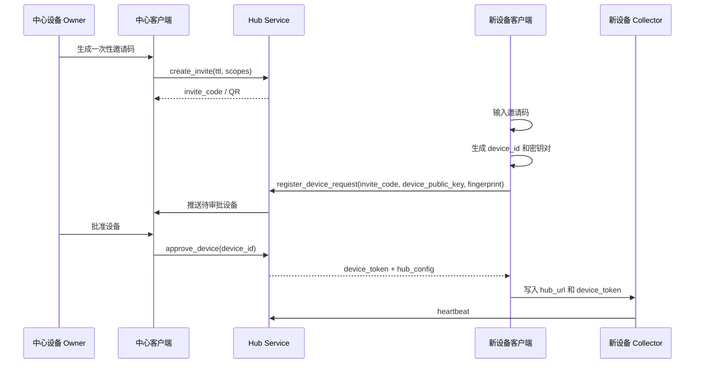

### 9.1 邀请码规则

- invite_code 使用 128-bit 以上安全随机数。
- 默认有效期 10 分钟。
- 默认只能使用一次。
- 可配置允许加入的设备类型和权限范围。
- 邀请码只用于首次注册，不作为长期身份凭证。

### 9.2 设备审批页显示字段

- 设备名称。
- 操作系统。
- 局域网 IP。
- Tailscale IP，可选。
- device fingerprint。
- public key 指纹。
- 首次申请时间。
- 申请来源邀请码。

---

## 10. 设备状态机

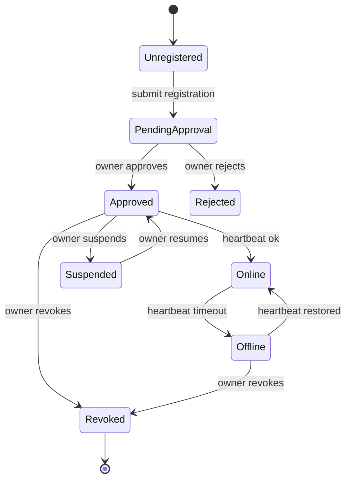

### 10.1 状态说明

- Unregistered：未注册。
- PendingApproval：等待中心设备审批。
- Approved：已授权。
- Online：心跳正常。
- Offline：心跳超时。
- Suspended：暂停同步，不允许上传和请求 context。
- Revoked：已撤销，token 作废。

---

## 11. 文件采集数据流

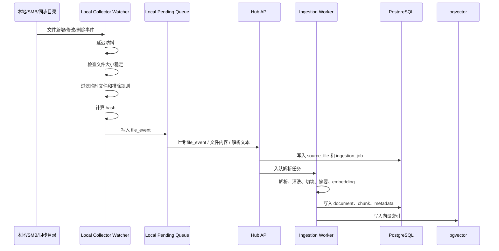

### 11.1 文件事件类型

- file_created
- file_modified
- file_deleted
- file_moved
- file_renamed
- file_hash_changed
- scan_discovered
- scan_missing

### 11.2 防抖策略

- 本地普通目录：延迟 5 秒。
- 同步盘目录：延迟 30 秒。
- SMB 目录：延迟 60 秒。
- 大文件：连续两次检查 size 和 mtime 稳定后再处理。

### 11.3 扫描兜底

- 实时监听用于快速响应。
- 每 6 小时增量扫描，根据 path、mtime、size、hash 对账。
- 每周全量扫描，修复监听漏报。

---

## 12. Agent 上下文请求数据流

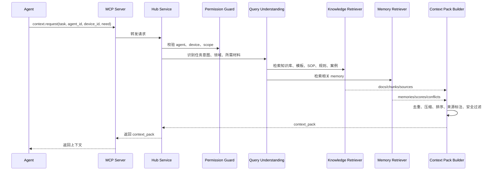

### 12.1 Context Pack 必须包含

- request_id。
- task_summary。
- matched_intent。
- relevant_memory。
- relevant_docs。
- templates。
- sop_checklist。
- rules。
- warnings。
- forbidden_actions。
- sources。
- confidence。
- expires_at。

### 12.2 Context Pack 示例

```json
{
  "request_id": "ctx_01HZ...",
  "agent_id": "codex",
  "device_id": "thinkpad",
  "task_summary": "继续设计 Knowledge Hub Desktop",
  "matched_intent": "technical_design",
  "context_pack": {
    "relevant_memory": [
      {
        "memory_id": "mem_001",
        "type": "decision",
        "content": "其他 Agent 不直接读取知识库，只通过 Hub 请求 context。",
        "confidence": 0.96
      }
    ],
    "relevant_docs": [
      {
        "doc_id": "doc_001",
        "title": "Knowledge Hub Desktop 技术方案",
        "excerpt": "客户端是用户唯一入口，Hub Service 是后台服务。",
        "source_path": "knowledge_base/README.md"
      }
    ],
    "templates": [],
    "rules": [
      "Agent 不得直接写正式 memory。",
      "所有候选 memory 必须进入 Review Queue。"
    ],
    "warnings": [
      "SMB 文件监听可能漏报，必须使用定时扫描兜底。"
    ]
  },
  "sources": ["mem_001", "doc_001"],
  "confidence": 0.91,
  "expires_at": "2026-05-03T14:00:00+08:00"
}
```

---

## 13. Agent 产出和 Memory 回流数据流

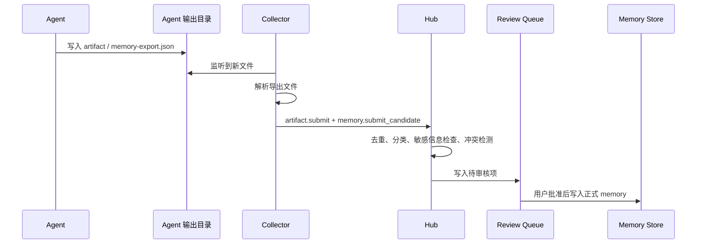

### 13.1 memory-export.json 标准

```json
{
  "schema_version": "1.0",
  "agent_id": "codex",
  "device_id": "thinkpad",
  "session_id": "ses_01HZ...",
  "task_id": "task_01HZ...",
  "created_at": "2026-05-03T12:00:00+08:00",
  "task_summary": "设计 Knowledge Hub Desktop 详细开发方案",
  "user_request": "补充具体细节、拓扑图、数据流等信息",
  "artifacts": [
    {
      "title": "详细开发方案",
      "type": "technical_spec",
      "content_path": "./Knowledge_Hub_Desktop_详细开发方案.md",
      "mime_type": "text/markdown",
      "hash": "sha256..."
    }
  ],
  "memories": [
    {
      "scope": "project",
      "type": "decision",
      "content": "Knowledge Hub Desktop 必须是完整客户端，不是网页后台。",
      "reason": "用户明确要求通过完整客户端呈现 Dashboard 和管理功能。",
      "confidence": 0.98,
      "suggested_visibility": "shared"
    }
  ]
}
```

---

## 14. Memory 审核状态机

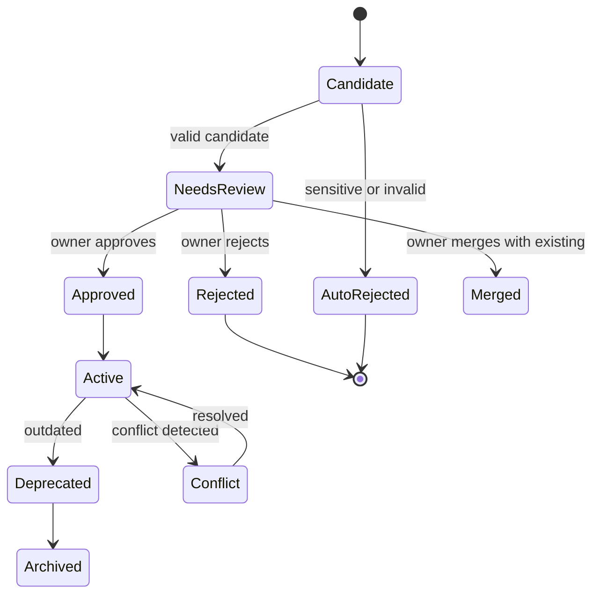

### 14.1 审核操作

- approve：批准为正式 memory。
- reject：拒绝。
- merge：合并到已有 memory。
- edit_and_approve：修改后批准。
- mark_sensitive：标记敏感。
- downgrade_scope：降低范围，例如 shared -> agent。
- set_expiry：设置过期时间。
- deprecate：废弃旧 memory。

---

## 15. 数据模型

### 15.1 workspace

```sql
create table workspace (
  id text primary key,
  name text not null,
  mode text not null check (mode in ('standalone', 'hub')),
  created_at timestamptz not null,
  updated_at timestamptz not null,
  encryption_key_version int not null default 1
);
```

### 15.2 device

```sql
create table device (
  id text primary key,
  workspace_id text not null references workspace(id),
  name text not null,
  role text not null check (role in ('hub', 'client', 'standalone')),
  status text not null check (status in ('pending', 'approved', 'online', 'offline', 'suspended', 'revoked')),
  public_key text,
  fingerprint text,
  os text,
  app_version text,
  last_seen_at timestamptz,
  created_at timestamptz not null,
  revoked_at timestamptz
);
```

### 15.3 data_source

```sql
create table data_source (
  id text primary key,
  workspace_id text not null references workspace(id),
  device_id text not null references device(id),
  name text not null,
  path text not null,
  source_type text not null check (source_type in ('local', 'smb', 'sync_folder', 'agent_output')),
  recursive boolean not null default true,
  include_globs jsonb not null default '[]',
  exclude_globs jsonb not null default '[]',
  scan_mode text not null check (scan_mode in ('watch', 'scheduled', 'watch_and_scan')),
  sensitivity text not null default 'normal',
  enabled boolean not null default true,
  created_at timestamptz not null,
  updated_at timestamptz not null
);
```

### 15.4 source_file

```sql
create table source_file (
  id text primary key,
  workspace_id text not null references workspace(id),
  device_id text not null references device(id),
  data_source_id text not null references data_source(id),
  path text not null,
  normalized_path text not null,
  file_name text not null,
  extension text,
  mime_type text,
  size_bytes bigint,
  mtime timestamptz,
  sha256 text,
  status text not null check (status in ('new', 'queued', 'indexed', 'deleted', 'error', 'ignored')),
  last_seen_at timestamptz,
  created_at timestamptz not null,
  updated_at timestamptz not null
);
```

### 15.5 document

```sql
create table document (
  id text primary key,
  workspace_id text not null references workspace(id),
  source_file_id text references source_file(id),
  title text,
  doc_type text check (doc_type in ('readme', 'sop', 'rules', 'template', 'case', 'faq', 'agent_guide', 'artifact', 'unknown')),
  language text default 'zh',
  summary text,
  owner text,
  last_updated date,
  review_frequency text,
  sensitivity text not null default 'normal',
  health_score numeric,
  status text not null check (status in ('draft', 'indexed', 'needs_review', 'archived')),
  created_at timestamptz not null,
  updated_at timestamptz not null
);
```

### 15.6 document_chunk

```sql
create table document_chunk (
  id text primary key,
  document_id text not null references document(id),
  chunk_index int not null,
  content text,
  content_ciphertext text,
  token_count int,
  embedding vector(1536),
  metadata jsonb not null default '{}',
  created_at timestamptz not null
);
```

### 15.7 memory

```sql
create table memory (
  id text primary key,
  workspace_id text not null references workspace(id),
  scope text not null check (scope in ('global', 'project', 'agent', 'device', 'session')),
  type text not null check (type in ('preference', 'semantic', 'procedural', 'decision', 'episodic', 'artifact', 'warning', 'case')),
  content text,
  content_ciphertext text,
  source text not null,
  source_id text,
  agent_id text,
  device_id text references device(id),
  confidence numeric not null default 0.5,
  visibility text not null check (visibility in ('private', 'agent', 'project', 'shared')),
  status text not null check (status in ('active', 'deprecated', 'archived', 'conflict')),
  expires_at timestamptz,
  last_used_at timestamptz,
  created_at timestamptz not null,
  updated_at timestamptz not null
);
```

### 15.8 memory_candidate

```sql
create table memory_candidate (
  id text primary key,
  workspace_id text not null references workspace(id),
  proposed_scope text,
  proposed_type text,
  content text,
  content_ciphertext text,
  reason text,
  source_agent_id text,
  source_device_id text references device(id),
  source_artifact_id text,
  confidence numeric not null default 0.5,
  review_status text not null check (review_status in ('candidate', 'needs_review', 'approved', 'rejected', 'merged', 'auto_rejected')),
  review_notes text,
  created_at timestamptz not null,
  reviewed_at timestamptz
);
```

### 15.9 artifact

```sql
create table artifact (
  id text primary key,
  workspace_id text not null references workspace(id),
  agent_id text,
  device_id text references device(id),
  title text not null,
  artifact_type text not null,
  content text,
  content_ciphertext text,
  file_path text,
  mime_type text,
  sha256 text,
  status text not null check (status in ('submitted', 'indexed', 'archived', 'rejected')),
  created_at timestamptz not null,
  updated_at timestamptz not null
);
```

### 15.10 event_log

```sql
create table event_log (
  id text primary key,
  workspace_id text not null references workspace(id),
  device_id text references device(id),
  actor_type text not null check (actor_type in ('user', 'device', 'agent', 'system')),
  actor_id text,
  event_type text not null,
  entity_type text,
  entity_id text,
  payload jsonb not null default '{}',
  created_at timestamptz not null
);
```

---

## 16. REST API 契约

### 16.1 设备注册

#### POST /api/invites

创建一次性邀请码。仅中心 Owner 可调用。

Request:

```json
{
  "ttl_seconds": 600,
  "allowed_role": "client",
  "scopes": ["file_upload", "context_request", "artifact_submit"]
}
```

Response:

```json
{
  "invite_id": "inv_01HZ...",
  "invite_code": "base64url-random",
  "expires_at": "2026-05-03T12:10:00+08:00",
  "qr_payload": "khub://join?hub=...&code=..."
}
```

#### POST /api/devices/register

Request:

```json
{
  "invite_code": "...",
  "device_name": "ThinkPad",
  "os": "Windows 11",
  "app_version": "0.1.0",
  "public_key": "...",
  "fingerprint": "..."
}
```

Response:

```json
{
  "device_id": "dev_01HZ...",
  "status": "pending",
  "message": "Waiting for owner approval"
}
```

#### POST /api/devices/{device_id}/approve

Response:

```json
{
  "device_id": "dev_01HZ...",
  "status": "approved",
  "device_token": "...",
  "hub_config": {
    "hub_url": "https://192.168.1.20:8443",
    "mcp_url": "https://192.168.1.20:8444/mcp"
  }
}
```

### 16.2 心跳

#### POST /api/devices/heartbeat

Request:

```json
{
  "device_id": "dev_01HZ...",
  "app_version": "0.1.0",
  "collector_status": "running",
  "pending_upload_count": 3,
  "watched_source_count": 5
}
```

Response:

```json
{
  "server_time": "2026-05-03T12:00:00+08:00",
  "device_status": "online",
  "commands": []
}
```

### 16.3 文件事件上传

#### POST /api/ingest/file-events

Request:

```json
{
  "device_id": "dev_01HZ...",
  "events": [
    {
      "event_id": "evt_01HZ...",
      "data_source_id": "src_01HZ...",
      "event_type": "file_modified",
      "path": "D:/Docs/plan.docx",
      "size_bytes": 123456,
      "mtime": "2026-05-03T11:58:00+08:00",
      "sha256": "..."
    }
  ]
}
```

Response:

```json
{
  "accepted": ["evt_01HZ..."],
  "rejected": []
}
```

### 16.4 Artifact 提交

#### POST /api/artifacts

Request:

```json
{
  "agent_id": "codex",
  "device_id": "dev_01HZ...",
  "title": "技术方案",
  "artifact_type": "technical_spec",
  "content": "...",
  "mime_type": "text/markdown",
  "sha256": "..."
}
```

Response:

```json
{
  "artifact_id": "art_01HZ...",
  "status": "submitted"
}
```

### 16.5 候选 Memory 提交

#### POST /api/memory/candidates

Request:

```json
{
  "agent_id": "codex",
  "device_id": "dev_01HZ...",
  "task_id": "task_01HZ...",
  "candidates": [
    {
      "scope": "project",
      "type": "decision",
      "content": "Knowledge Hub Desktop 必须是完整客户端。",
      "reason": "用户明确要求。",
      "confidence": 0.98
    }
  ]
}
```

Response:

```json
{
  "accepted": [
    {
      "candidate_id": "mc_01HZ...",
      "review_status": "needs_review"
    }
  ]
}
```

### 16.6 Context 请求

#### POST /api/context/request

Request:

```json
{
  "agent_id": "codex",
  "device_id": "dev_01HZ...",
  "task": "实现 Local Collector 文件监听",
  "need": ["技术约束", "数据模型", "API 契约", "验收标准"],
  "max_tokens": 6000
}
```

Response:

```json
{
  "request_id": "ctx_01HZ...",
  "context_pack": {
    "summary": "...",
    "relevant_memory": [],
    "relevant_docs": [],
    "rules": [],
    "warnings": [],
    "sources": []
  },
  "confidence": 0.9
}
```

---

## 17. MCP 工具定义

### 17.1 context.request

输入：

```json
{
  "task": "string",
  "agent_id": "string",
  "device_id": "string",
  "need": ["string"],
  "max_tokens": 6000
}
```

输出：

```json
{
  "context_pack": {},
  "sources": [],
  "confidence": 0.0
}
```

### 17.2 memory.submit_candidate

输入：

```json
{
  "agent_id": "string",
  "device_id": "string",
  "task_id": "string",
  "candidates": []
}
```

输出：

```json
{
  "accepted": [],
  "rejected": []
}
```

### 17.3 artifact.submit

输入：

```json
{
  "agent_id": "string",
  "device_id": "string",
  "title": "string",
  "artifact_type": "string",
  "content": "string"
}
```

输出：

```json
{
  "artifact_id": "string",
  "status": "submitted"
}
```

### 17.4 policy.check

输入：

```json
{
  "content": "string",
  "policy_scope": "writing|security|sop|agent",
  "task_type": "string"
}
```

输出：

```json
{
  "passed": true,
  "findings": [],
  "recommended_changes": []
}
```

---

## 18. 权限模型

### 18.1 Device 权限

- file_upload：允许上传文件事件和解析文本。
- artifact_submit：允许提交 artifact。
- memory_candidate_submit：允许提交候选 memory。
- context_request：允许请求 context pack。
- admin_approve_device：允许审批设备，第一版仅 Owner 本机。
- admin_review_memory：允许审核 memory，第一版仅 Owner 本机。

### 18.2 Agent 权限

- context_read：请求上下文。
- memory_candidate_write：提交候选 memory。
- artifact_write：提交产出。
- policy_check：请求规则检查。
- template_read：读取模板。

### 18.3 Scope 规则

- global：默认只有 Owner 和授权 Agent 可读。
- project：项目相关 Agent 可读。
- agent：仅对应 Agent 或 Owner 可读。
- device：仅本设备、中心和 Owner 可读。
- session：默认只在当前 session 内使用，可选择归档。

---

## 19. 加密设计

### 19.1 传输加密

- 多设备模式必须启用 HTTPS。
- 开发环境可以允许 HTTP，但必须显示不安全提示。
- 支持自签证书。
- 支持用户导入证书。
- 支持 Tailscale 地址优先。

### 19.2 请求签名

签名原文：

```text
method + "\n" + path + "\n" + timestamp + "\n" + nonce + "\n" + sha256(body)
```

Header：

```text
X-KH-Device-Id
X-KH-Timestamp
X-KH-Nonce
X-KH-Signature
```

校验规则：

- timestamp 与服务器时间差不超过 5 分钟。
- nonce 在 10 分钟内不能重复。
- device 必须 approved。
- device_token 未撤销。
- signature 正确。

### 19.3 存储加密

- workspace_master_key 存在本机安全存储或加密配置文件。
- data_encryption_key 由 master key 派生。
- sensitive content 使用 AES-256-GCM。
- 每条记录独立 nonce。
- key_version 写入记录。
- 支持未来 key rotation。

---

## 20. Context Pack Builder 逻辑

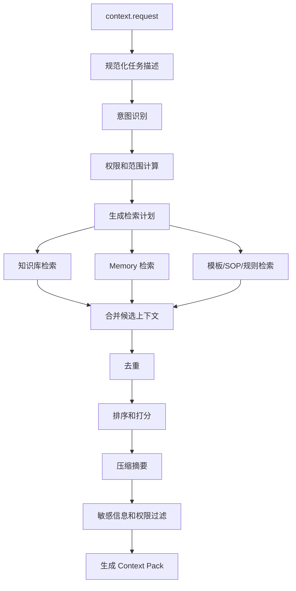

### 20.1 检索策略

- 关键词检索：标题、路径、摘要、标签。
- 向量检索：document_chunk embedding。
- Memory 检索：scope + type + embedding + recency。
- 规则优先：Rules、SOP、Templates 权重高于普通文档。
- 决策优先：decision memory 权重高于 episodic memory。
- 新近性：近期被确认或使用的 memory 权重更高。
- 过期降权：expires_at 过期或 deprecated 的 memory 不进入默认结果。

### 20.2 输出压缩规则

- 先给短摘要，再给可用事实。
- 对规则类内容保留 Do / Don't。
- 对 SOP 保留步骤顺序。
- 对模板保留标题结构。
- 对案例保留背景、处理方式、风险、可复用建议。
- 每条上下文必须带 source id。

---

## 21. Knowledge 文档健康度评分

评分维度：

- 有明确标题：10 分。
- 有文档目的：10 分。
- 有适用场景：10 分。
- 有背景信息：10 分。
- 有 Do / Don't：15 分。
- 有标准流程：15 分。
- 有标准示例：15 分。
- 有 FAQ：5 分。
- 有 Owner：5 分。
- 有 Last Updated：5 分。

总分 100。低于 60 分标记为 needs_improvement。

---

## 22. Review Queue 规则

### 22.1 Candidate Memory 自动拒绝条件

- 包含明显 API Key、Token、密码。
- 包含未经脱敏的身份证号、银行卡号等高敏信息。
- 内容为空或过短。
- 内容明显是一次性临时过程。
- 与已有 active memory 完全重复。

### 22.2 需要人工审核条件

- 涉及长期偏好。
- 涉及项目决策。
- 涉及规则和流程变化。
- 置信度低于 0.8 但高于 0.4。
- 与已有 memory 存在冲突。

### 22.3 自动合并候选条件

- 同类型。
- 同 scope。
- 与已有 memory 相似度高。
- 内容是已有 memory 的补充，而非冲突。

---

## 23. 桌面客户端页面规格

### 23.1 Dashboard

必须展示：

- 当前模式：单机 / 中心 / 客户端。
- Hub 状态：运行中 / 停止 / 错误。
- Collector 状态。
- MCP endpoint。
- 今日新增文件数。
- 已索引文档数。
- Memory 总数。
- Candidate Memory 待审核数。
- Artifact 数。
- 在线设备数。
- 最近错误。

主要操作：

- 启动/停止 Hub。
- 启动/停止 Collector。
- 添加数据源。
- 生成设备邀请码。
- 打开 Review Queue。

### 23.2 数据源页面

字段：

- 名称。
- 路径。
- 类型：local / smb / sync_folder / agent_output。
- 递归。
- 包含文件类型。
- 排除规则。
- 扫描模式。
- 敏感等级。
- 是否上传原文。
- 最近扫描时间。
- 状态。

操作：

- 添加。
- 编辑。
- 暂停。
- 删除。
- 立即扫描。
- 查看错误。

### 23.3 设备页面

列表字段：

- 设备名。
- 角色。
- 状态。
- IP。
- OS。
- App 版本。
- 最后心跳。
- 指纹。

操作：

- 批准。
- 拒绝。
- 暂停。
- 恢复。
- 撤销。
- 重新生成 token。

### 23.4 Agent 页面

字段：

- Agent ID。
- 显示名。
- 类型。
- MCP 使用状态。
- 输出目录。
- 权限。
- Memory 策略。
- 最近调用时间。

操作：

- 添加 Agent。
- 配置输出目录。
- 复制 MCP 配置。
- 暂停 Agent。
- 查看调用日志。

### 23.5 Memory 页面

视图：

- Active Memory。
- Candidate Memory。
- Conflict Memory。
- Deprecated Memory。
- Archived Memory。

过滤：

- scope。
- type。
- agent_id。
- device_id。
- confidence。
- status。
- date。

操作：

- approve。
- reject。
- edit and approve。
- merge。
- deprecate。
- archive。
- delete，需要二次确认。

---

## 24. 错误处理和恢复

### 24.1 Collector 离线

- 写入 SQLite pending queue。
- UI 显示 pending count。
- 每 60 秒重试。
- 恢复连接后按 event created_at 顺序补传。

### 24.2 Hub 不可达

- 客户端显示离线。
- 禁止提交正式操作。
- context 请求可使用 recent context cache，并标记 not_fresh。

### 24.3 解析失败

- source_file.status = error。
- ingestion_job 记录 error_message。
- UI 提供重试。
- 连续失败 3 次后进入 failed 列表。

### 24.4 加密失败

- 阻止上传。
- 本地保留 pending。
- UI 高亮安全错误。
- 不允许降级为明文传输，除非用户在开发模式显式开启。

---

## 25. 日志和审计

必须记录：

- 设备注册和撤销。
- Agent context 请求。
- Memory candidate 提交。
- Memory 审核操作。
- Artifact 提交。
- 数据源添加、删除、扫描。
- 文件解析失败。
- 权限拒绝。
- 加密错误。

日志等级：

- debug。
- info。
- warn。
- error。
- security。

审计日志不可由 Agent 修改。

---

## 26. 开发任务拆分

### 26.1 前端 Agent 任务

- 实现 Tauri + React Shell。
- 实现首次启动向导。
- 实现 Dashboard。
- 实现数据源管理页。
- 实现设备管理页。
- 实现 Agent 管理页。
- 实现 Memory Review Queue。
- 实现设置页。
- 实现服务状态轮询。

验收：

- 无后端时可使用 mock 数据展示所有页面。
- 所有核心状态有 loading、empty、error。
- 所有危险操作有确认。
- 页面适配 1366x768 和 1920x1080。

### 26.2 桌面端 Agent 任务

- 实现 Tauri service manager。
- 启动/停止 hub-service。
- 启动/停止 local-collector。
- 检查端口占用。
- 管理本地配置文件。
- 系统托盘。
- 开机自启可选。

验收：

- 客户端可一键启动/停止本机 Hub。
- 服务异常退出后 UI 能感知。
- 配置文件损坏时有恢复提示。

### 26.3 后端 Agent 任务

- 实现 FastAPI 项目骨架。
- 实现 workspace、device、data_source、source_file、document、memory、artifact、event_log 数据模型。
- 实现设备注册 API。
- 实现数据源 API。
- 实现文件事件 ingest API。
- 实现 artifact API。
- 实现 memory candidate API。
- 实现 context.request API。
- 实现审计日志。

验收：

- OpenAPI 文档完整。
- 所有 API 有权限校验。
- 所有写操作写 event_log。
- 单元测试覆盖核心 API。

### 26.4 Collector Agent 任务

- 实现 Python watchdog 目录监听。
- 实现 SMB/sync folder 防抖。
- 实现 SQLite pending queue。
- 实现 hash 计算。
- 实现 include/exclude globs。
- 实现增量扫描和全量扫描。
- 实现上传重试。

验收：

- 新增、修改、删除文件能产生事件。
- Hub 离线时事件不丢。
- Hub 恢复后补传。
- 临时文件被正确忽略。

### 26.5 Worker Agent 任务

- 实现解析 pipeline。
- 支持 md、txt、pdf、docx。
- 预留 xlsx、pptx。
- 实现 chunking。
- 实现摘要。
- 实现 embedding 写入 pgvector。
- 实现文档健康度评分。

验收：

- 可索引至少 100 个测试文档。
- 解析失败有错误记录。
- chunk 可检索。
- health_score 可计算。

### 26.6 MCP Agent 任务

- 实现 MCP Server。
- 暴露 context.request、memory.submit_candidate、artifact.submit、policy.check。
- 实现 Agent token。
- 实现调用日志。

验收：

- Codex/Gemini CLI 可通过 MCP 调用 context.request。
- 返回 JSON schema 稳定。
- 错误返回可读。

### 26.7 安全 Agent 任务

- 实现设备密钥生成。
- 实现请求签名。
- 实现 nonce 防重放。
- 实现 HTTPS 配置。
- 实现敏感字段 AES-256-GCM 加密。
- 实现 token 撤销。

验收：

- 未签名请求被拒绝。
- 重放 nonce 被拒绝。
- revoked device 被拒绝。
- 数据库敏感字段不是明文。

### 26.8 测试 Agent 任务

- 编写端到端测试场景。
- 编写 API 测试。
- 编写 Collector 离线补传测试。
- 编写设备注册测试。
- 编写 Memory 审核测试。
- 编写 context.request 测试。

验收：

- 提供测试报告。
- 覆盖 happy path 和 failure path。
- 至少包含单机模式和多设备模式核心链路。

---

## 27. MVP 验收标准

### 27.1 单机模式

- 用户安装并打开客户端。
- 选择本机模式。
- 添加一个本地目录。
- 系统扫描并索引 md、txt、pdf、docx。
- 用户能在 Dashboard 看到文档数量。
- Agent 能通过 MCP 调用 context.request。
- 用户能手动添加 memory。
- 用户能查看 active memory。

### 27.2 多设备模式

- 迷你主机客户端选择中心模式。
- 笔记本客户端通过邀请码申请加入。
- 中心客户端批准设备。
- 笔记本配置一个本地目录。
- 笔记本 Collector 上传文件事件。
- 中心能看到来自该设备的文件。
- 笔记本 Agent 能请求中心 context。
- 中心撤销设备后，该设备不能继续请求 context。

### 27.3 Agent 回流

- Codex 或 Gemini CLI 写入 memory-export.json。
- Collector 捕获文件。
- Hub 生成 candidate memory。
- Dashboard 显示待审核。
- 用户批准后成为 active memory。
- 下一次 context.request 能检索到该 memory。

### 27.4 安全

- 多设备请求必须签名。
- revoked device 请求失败。
- 重放请求失败。
- memory.content 加密存储。
- Dashboard 能显示安全状态。

---

## 28. 配置文件示例

### 28.1 desktop config

```json
{
  "app_version": "0.1.0",
  "mode": "hub",
  "workspace_id": "ws_01HZ...",
  "device_id": "dev_01HZ...",
  "hub_url": "https://127.0.0.1:8443",
  "mcp_url": "https://127.0.0.1:8444/mcp",
  "data_dir": "C:/Users/user/AppData/Roaming/KnowledgeHub",
  "services": {
    "hub": {"enabled": true, "port": 8443},
    "mcp": {"enabled": true, "port": 8444},
    "collector": {"enabled": true}
  }
}
```

### 28.2 collector config

```json
{
  "device_id": "dev_01HZ...",
  "hub_url": "https://192.168.1.20:8443",
  "pending_db": "collector-pending.sqlite",
  "sources": [
    {
      "id": "src_docs",
      "name": "WPS Cloud",
      "path": "C:/Users/user/Documents/WPS Cloud",
      "source_type": "sync_folder",
      "recursive": true,
      "include_globs": ["**/*.pdf", "**/*.docx", "**/*.md", "**/*.txt"],
      "exclude_globs": ["**/~$*", "**/*.tmp", "**/.git/**", "**/node_modules/**"],
      "scan_mode": "watch_and_scan",
      "debounce_seconds": 30
    }
  ]
}
```

### 28.3 agent config

```json
{
  "agent_id": "codex",
  "display_name": "Codex",
  "permissions": ["context_read", "artifact_write", "memory_candidate_write"],
  "output_dirs": ["D:/AgentOutputs/codex"],
  "memory_policy": {
    "allow_candidate_submit": true,
    "default_scope": "project",
    "require_review": true
  }
}
```

---

## 29. 目录结构建议

```text
knowledge-hub-desktop/
  apps/
    desktop/
      src-tauri/
      src/
    hub-service/
      app/
      migrations/
      tests/
    worker/
      app/
    mcp-server/
      src/
    local-collector/
      collector/
      tests/
  packages/
    schemas/
    crypto/
    context-builder/
    shared-types/
  docs/
    api/
    architecture/
  docker-compose.dev.yml
  README.md
```

---

## 30. 版本路线图

### V0.1 开发预览

- 单机模式。
- 本地目录扫描。
- md/txt/pdf/docx 解析。
- 基础 context.request。
- 手动 memory。

### V0.2 多设备 Alpha

- 中心模式。
- 客户端注册。
- 心跳。
- 文件事件上传。
- 离线 pending queue。

### V0.3 Agent Alpha

- MCP Server。
- memory-export.json。
- artifact submit。
- candidate memory review。

### V0.4 安全 Beta

- HTTPS。
- 请求签名。
- nonce 防重放。
- sensitive field encryption。
- 设备撤销。

### V0.5 产品 Beta

- 完整 Dashboard。
- 安装包。
- 托盘常驻。
- 备份恢复。
- 日志和诊断。

---

## 31. 给开发 Agent 的硬性要求

1. 不要让 Agent 直接访问 PostgreSQL、pgvector 或文件库。
2. 不要把 candidate memory 直接写入 active memory。
3. 不要跳过设备注册和权限校验。
4. 不要依赖网盘官方 API，第一版只处理本地路径。
5. 不要只做网页后台，必须有 Desktop Client。
6. 不要把敏感字段明文长期保存。
7. 不要只依赖文件监听，必须有定时扫描兜底。
8. 不要把 Hub 不可达时的上传事件丢弃，必须有 pending queue。
9. 不要返回无来源的关键上下文，context pack 必须包含 sources。
10. 不要把 Review Queue 做成可选项，它是 memory 治理核心。

---

## 32. 最终交付定义

一个可运行的 Knowledge Hub Desktop 系统，用户可以：

- 打开完整客户端。
- 选择单机或多设备。
- 将迷你主机设为中心节点。
- 用邀请码注册其他电脑。
- 配置本地、SMB、同步目录。
- 配置 OpenClaw、HERMES、Codex、Gemini CLI 的输出目录和权限。
- 自动归集文件和 Agent 产出。
- 通过 MCP/API 为 Agent 提供 context pack。
- 审核 candidate memory。
- 将有价值的 memory 沉淀为长期共享记忆。
- 撤销设备、查看日志、诊断错误、备份恢复。

这就是本项目的开发基线。
